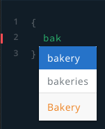
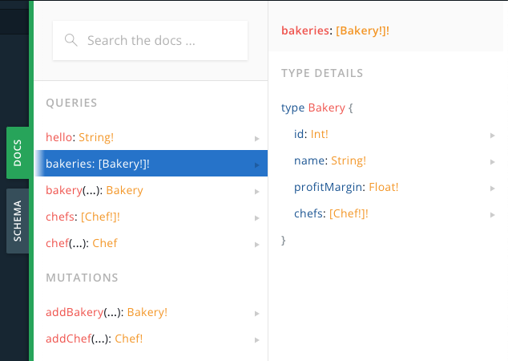

# Optional: GraphQL Playground

## Overview

When you are developing the GraphQL API, you probably want to send requests to verify the correctness of your implementation.

A locally hosted GraphQL Playground is perfect for this.

Simply type your request body on the left and the response data will be shown on the right.


## Setup

Add a `GET` handler that returns a `rocket::response::content::RawHTML<String>`, which is the Playground HTML generated by `async-graphql`:

```rust, no_run
// src/main.rs

...

use async_graphql::{EmptySubscription, Schema};
use async_graphql::{
+   http::{playground_source, GraphQLPlaygroundConfig},
    EmptySubscription, Schema,
};
use async_graphql_rocket::*;
- use rocket::*;
+ use rocket::{response::content, *};

...

+ #[rocket::get("/graphql")]
+ fn graphql_playground() -> content::RawHtml<String> {
+   content::RawHtml(playground_source(GraphQLPlaygroundConfig::new("/graphql")))
+ }

...

    rocket::build()
        .manage(schema)
-       .mount("/", routes![index, graphql_request])
+       .mount("/", routes![index, graphql_playground, graphql_request])

...
```

## Major Merits

### Autocomplete requests



The Playground discovers all the types and their attributes and autocompletes your requests for you.

### Preview Documentation



You can open up the DOCS panel on the side to see the comprehensive documentation for your GraphQL API.

### Export Schema


On the SCHEMA panel, you can view the [schema](https://graphql.org/learn/schema/) of your GraphQL API, and export it in JSON or SDL format.
